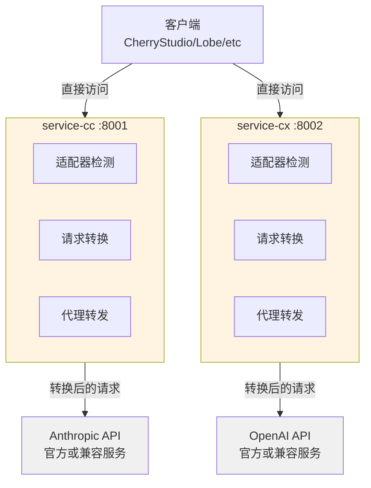

# CC-Proxy 架构文档 (AI 开发指南)

> 本文档为 AI 开发人员提供项目架构、代码规范和开发指南

## 📋 项目概览

**项目名称**: CC-Proxy
**技术栈**: Python 3.11+ | FastAPI 0.115+ | Pydantic 2.10+ | Gunicorn 23.0+
**架构模式**: 双服务架构 (service-cc + service-cx,已移除 Gateway)
**包管理**: uv
**容器化**: Docker Compose

---

## ⚡ 最新变更 (2025-10-31)

### 🎯 Pipeline 架构重构 (重大更新)

**目标**: 统一 service-cc 和 service-cx 架构,提取公共转换逻辑

**成果**:
- ✅ **代码精简**: service-cc (-18%), service-cx (-74%),总计减少 59%
- ✅ **架构统一**: 两个服务使用相同的 Pipeline Pattern
- ✅ **逻辑保留**: 100% 保留原有转换逻辑
- ✅ **易于扩展**: 新增客户端只需 20-30 行代码

**核心变更**:

1. **新增 common/transforms/** - 6 个可复用 Transformer
   - `SystemPromptTransformer` - 系统提示词注入
   - `MessageNormalizerTransformer` - 消息格式标准化
   - `ToolsMergerTransformer` - 工具合并
   - `FieldResolverTransformer` - 字段解析
   - `SessionTransformer` - Session 管理
   - `EnvironmentContextTransformer` - 环境上下文

2. **Pipeline 配置化** - 转换流程声明式定义
   - service-cc: 3 步 Pipeline (Claude API)
   - service-cx: 6 步 Pipeline (OpenAI Codex API)

3. **Adapter 简化** - 只负责检测和委托
   - service-cc/adapters/cherry_studio.py: 121 → 99 行
   - service-cx/adapters/cherry_studio.py: 339 → 89 行

**详细报告**: `/claudedocs/unified-architecture-refactor-report.md`

---

## ⚡ 之前变更 (2025-10-30)

### 🔴 架构简化
- ✅ **移除 Gateway 层** - 符合 KISS 原则,只有 2 个服务不需要 Gateway
- ✅ **双服务直连** - 客户端直接访问 service-cc:8001 和 service-cx:8002
- ✅ **减少网络跳转** - 降低 20-50ms 延迟,提升响应速度

### 🚀 统一启动
- ✅ **start.py 启动脚本** - 根据 ENVIRONMENT 自动选择 uvicorn/gunicorn
- ✅ **开发环境** - `ENVIRONMENT=test python start.py` (uvicorn + reload)
- ✅ **生产环境** - `ENVIRONMENT=production python start.py` (gunicorn + 4 workers)

### 📝 环境日志
- ✅ **Production** - 不记录请求体/响应体,只记录元数据
- ✅ **Test** - 记录完整请求体/响应体,用于调试
- ✅ **统一配置** - 通过 `ENVIRONMENT` 环境变量控制

### 🔧 其他改进
- ✅ **Gunicorn 依赖** - 添加生产环境多进程支持
- ✅ **配置优化** - 添加 `is_test_environment` 属性判断
- ✅ **文档更新** - README 和 CLAUDE.md 反映新架构

---

## 🏗️ 系统架构 (当前版本)

### 架构图



**架构说明**:
- 🟡 **service-cc/cx**: 独立服务,负责适配、转换、代理、日志、错误处理
- ⚪ **外部 API**: 实际服务提供商

### 目录结构

```
.
├── start.py               # 统一启动脚本 (uvicorn/gunicorn)
├── .env.example           # 环境变量示例
├── pyproject.toml         # 项目配置和依赖
│
├── common/                # 共享库
│   ├── config.py          # 配置管理 (Environment 支持)
│   ├── logger.py          # 结构化日志 (环境日志策略)
│   ├── http_client.py     # HTTP/2 客户端 (单例)
│   ├── errors.py          # 异常体系
│   ├── types.py           # 类型定义
│   ├── metrics.py         # Prometheus 指标
│   ├── adapters/          # 共享适配器基类
│   │   ├── base.py        # ClientAdapter 基类
│   │   └── context.py     # AdapterContext 和 TransformResult
│   └── transforms/        # 🆕 转换器库 (Pipeline Pattern)
│       ├── base.py        # Transformer 基类 + TransformContext
│       ├── pipeline.py    # TransformPipeline 执行器
│       ├── system_prompt.py           # 系统提示词注入
│       ├── message_normalizer.py      # 消息格式标准化
│       ├── tools_merger.py            # 工具合并
│       ├── field_resolver.py          # 字段解析
│       ├── session.py                 # Session 管理
│       └── environment_context.py     # 环境上下文
│
├── service-cc/            # Claude 代理服务 :8001
│   ├── main.py            # FastAPI 应用
│   ├── router.py          # API 路由 (环境日志)
│   ├── proxy.py           # Anthropic API 代理
│   ├── pipelines/         # 🆕 Pipeline 配置
│   │   └── cherry_studio.py  # CherryStudio → Claude 管道
│   ├── adapters/          # 客户端适配器
│   │   ├── cherry_studio.py  # CherryStudio 适配器
│   │   ├── claude_code.py     # Claude Code 适配器
│   │   └── manager.py     # 适配器管理器
│   ├── formats/           # 格式定义
│   │   ├── claude_code.py # Claude Code system prompt
│   │   └── session.py     # Session 管理 (12小时轮换)
│   └── schemas/           # Pydantic 数据模型
│       ├── base.py        # 基础模型
│       ├── request.py     # 请求模型
│       └── response.py    # 响应模型
│
├── service-cx/            # Codex 代理服务 :8002
│   ├── main.py            # FastAPI 应用
│   ├── router.py          # API 路由 (环境日志)
│   ├── proxy.py           # OpenAI API 代理
│   ├── adapters/          # 客户端适配器
│   │   ├── cherry_studio.py  # CherryStudio 适配器
│   │   ├── custom.py      # 自定义客户端适配器
│   │   └── manager.py     # 适配器管理器
│   ├── formats/           # 格式定义
│   │   └── codex_instructions.py  # Codex instructions
│   └── schemas/           # Pydantic 数据模型
│
└── claudedocs/            # AI 开发文档
    ├── architecture-review.md           # 架构评审报告
    ├── redundancy-analysis-report.md    # 冗余代码分析
    ├── security-audit-report.md         # 安全审计报告
    └── performance-analysis-report.md   # 性能分析报告
```

---

## 🎯 核心设计思路

### KISS 原则: 双服务直连

**架构演进**:
- ❌ **旧架构**: Gateway (8000) → service-cc (8001) / service-cx (8002)
- ✅ **新架构**: 客户端 → service-cc (8001) / service-cx (8002)

**为什么移除 Gateway?**
1. **违背 KISS**: 只有 2 个服务,不需要 Gateway 层
2. **减少延迟**: 去掉一次网络跳转,降低 20-50ms
3. **简化部署**: 减少 1 个 Docker 容器,减少 1000+ 行代码
4. **符合理念**: "单体应用 → 必要时才拆分",而非"一开始就微服务"

### 服务职责

```
service-cc / service-cx:
  ✅ API 路由和端点
  ✅ 认证: API Key 验证
  ✅ 日志: 环境区分 (production/test)
  ✅ 适配器: 检测客户端类型
  ✅ 转换: 请求格式转换 (注入 prompt、session)
  ✅ 代理: 转发到外部 API
  ✅ 错误处理: 统一异常格式
  ✅ 监控: Prometheus 指标
```

---

## 🚀 数据流详解

### 完整请求流程 (当前架构)

```
1. 客户端发送请求
   POST http://localhost:8001/v1/messages
   Header: x-api-key: YOUR_ANTHROPIC_API_KEY
   Body: {"model": "claude-sonnet-4", "messages": [...]}

2. service-cc 处理请求
   ├─ router.py:create_message()
   │   ├─ 提取 API Key
   │   ├─ 验证请求体 (Pydantic)
   │   ├─ 环境日志: 根据 ENVIRONMENT 决定是否记录请求体
   │   └─ 调用适配器管理器
   │
   ├─ adapter_manager.transform()
   │   ├─ 检测客户端类型 (CherryStudio)
   │   ├─ 注入 Claude Code system prompt
   │   ├─ 添加 12小时 session
   │   └─ 保留 thinking 字段 (透传给目标服务)
   │
   └─ proxy.py:proxy_to_anthropic()
       └─ 代理到配置的 Anthropic API 端点

3. 响应返回
   Anthropic API → service-cc → 客户端
```

---

## 🔧 核心组件详解

### 1. 统一启动脚本 (start.py)

**功能**: 根据 `ENVIRONMENT` 自动选择启动方式

```python
# 开发环境 (uvicorn + reload)
ENVIRONMENT=test python start.py

# 生产环境 (gunicorn + 4 workers)
ENVIRONMENT=production python start.py
```

**实现**:
```python
def main():
    if settings.environment.lower() in ("production", "prod"):
        # 使用 gunicorn (多进程)
        start_production()
    else:
        # 使用 uvicorn (单进程 + reload)
        start_development()
```

---

### 2. 环境日志策略 (common/logger.py + common/config.py)

**目的**: 生产环境不记录敏感数据,测试环境记录详细日志

**配置**:
```python
# common/config.py
class Settings(BaseSettings):
    environment: str = "production"  # production | test

    @property
    def is_test_environment(self) -> bool:
        return self.environment.lower() in ("test", "dev", "development")
```

**使用**:
```python
# service-cc/router.py
log_data = {
    "model": body.get("model"),
    "message_count": len(body.get("messages", [])),
}

# 测试环境记录详细请求体
if settings.is_test_environment:
    log_data["request_body"] = body

logger.info("claude_request", **log_data)
```

---

### 3. service-cc (Claude 代理服务)

**文件**: `service-cc/main.py`, `service-cc/router.py`, `service-cc/proxy.py`

**核心功能**:

#### 3.1 客户端适配器系统

**设计模式**: 适配器模式 (Adapter Pattern)

**问题**: 不同客户端的请求格式不同
- CherryStudio 发送 `thinking` 字段 (需要透传给 88code)
- 需要注入 Claude Code system prompt
- 需要添加 session 以优化缓存命中率

**解决方案**: 使用统一的适配器基类

```python
# common/adapters/base.py (统一基类)
class ClientAdapter(ABC):
    priority: int = 0  # 优先级 (数字越大越优先)

    @abstractmethod
    def detect(self, ctx: AdapterContext) -> bool:
        """检测是否匹配此适配器"""
        pass

    @abstractmethod
    def transform(self, ctx: AdapterContext) -> TransformResult:
        """转换请求格式"""
        pass

# service-cc/adapters/cherry_studio.py
class CherryStudioAdapter(ClientAdapter):
    priority = 50

    def detect(self, ctx: AdapterContext) -> bool:
        ua = ctx.raw_headers.get("user-agent", "").lower()
        return "cherrystudio" in ua

    def transform(self, ctx: AdapterContext) -> TransformResult:
        body = ctx.raw_body.copy()

        # 1. 注入 Claude Code system prompt
        body["system"] = CLAUDE_CODE_SYSTEM

        # 2. 添加 12小时 session (优化缓存)
        if not body.get("metadata", {}).get("user_id"):
            body["metadata"] = session_manager.get_session()

        # 3. 保留 thinking 字段 (透传给目标服务)
        # ✅ 不再删除 thinking 字段

        return TransformResult(
            body=body,
            headers=ctx.raw_headers,
            metadata={"adapter": "cherry_studio"},
        )
```

**使用流程**:
```python
# service-cc/router.py
@router.post("/v1/messages")
async def create_message(request: Request):
    body = await request.json()
    headers = dict(request.headers)

    # 构建适配器上下文
    ctx = AdapterContext(raw_body=body, raw_headers=headers)

    # 自动检测并应用适配器
    result = adapter_manager.transform(ctx)

    # 代理到 Anthropic API
    response = await proxy_to_anthropic(result.body, api_key)
    return response
```

#### 3.2 Session 轮换机制

**目的**: 最大化 Claude API 缓存命中率 (Prompt Caching)

**实现**: 每 12 小时轮换一次 session ID

```python
# service-cc/formats/session.py
class SessionManager:
    def get_session(self) -> dict:
        now = time.time()

        # 缓存未过期,返回缓存
        if self._cache and now < self._expire_time:
            return self._cache

        # 生成新 session
        timestamp = datetime.now().strftime("%Y-%m-%d")
        half_day_mark = int(now // (12 * 3600))  # 0:00, 12:00 轮换
        self._counter += 1

        session_id = f"user_proxy_account__session_{timestamp}-{half_day_mark}-{self._counter}"

        self._cache = {"user_id": session_id}
        self._expire_time = now + 12 * 3600
        return self._cache
```

**Session ID 格式**: `user_proxy_account__session_{date}-{半天标记}-{计数器}`

---

### 4. service-cx (Codex 代理服务)

**结构**: 与 service-cc 类似,专注于 OpenAI Codex API

**职责**:
- 适配 OpenAI Codex Responses API 格式
- 代理请求到 OpenAI API (88code)
- 处理 OpenAI 特有的错误格式
- 环境日志策略 (production/test)

**适配器**:
- **CherryStudioAdapter**: 检测 CherryStudio 客户端
- **CustomAdapter**: 自定义客户端适配
- **DefaultAdapter**: 默认透传

---

### 5. common (共享库)

#### 5.1 HTTP/2 客户端 (单例模式)

**优势**:
- 连接复用 (减少 TCP 握手)
- 多路复用 (单连接并发多请求)
- Header 压缩 (HPACK)

```python
# common/http_client.py
class HTTPClient:
    _instance = None
    _lock = Lock()

    def __new__(cls):
        if cls._instance is None:
            with cls._lock:
                if cls._instance is None:
                    cls._instance = super().__new__(cls)
        return cls._instance

    def _create_client(self):
        return httpx.AsyncClient(
            http2=True,
            limits=httpx.Limits(
                max_keepalive_connections=100,
                max_connections=200,
            ),
            timeout=httpx.Timeout(timeout=120.0),
        )
```

#### 5.2 配置管理 (Pydantic Settings + Environment)

```python
# common/config.py
class Settings(BaseSettings):
    # 环境配置
    environment: str = "production"  # production | test

    # 服务配置
    claude_service_host: str = "0.0.0.0"
    claude_service_port: int = 8001
    codex_service_host: str = "0.0.0.0"
    codex_service_port: int = 8002

    # 外部 API
    anthropic_base_url: str = "https://api.anthropic.com"  # 可配置
    openai_base_url: str = "https://api.openai.com/v1"     # 可配置

    # 日志配置
    log_level: str = "INFO"
    log_format: str = "json"

    @property
    def is_test_environment(self) -> bool:
        """判断是否为测试环境"""
        return self.environment.lower() in ("test", "dev", "development")

    model_config = SettingsConfigDict(
        env_file=".env",
        case_sensitive=False,
    )

settings = Settings()
```

#### 5.3 结构化日志 (structlog + 环境策略)

```python
# common/logger.py
from common.logger import logger

logger.info("request_received", method="POST", path="/v1/messages")
logger.error("api_error", error=str(e), status_code=500)
```

---

## 📝 代码规范

### 文件命名

- 文件名: `snake_case.py`
- 类名: `PascalCase`
- 函数名: `snake_case()`
- 常量: `UPPER_SNAKE_CASE`

### 类型注解

**必须**: 100% 类型注解覆盖

```python
def transform_request(
    body: dict[str, Any],
    headers: dict[str, str],
    api_key: str | None = None,
) -> dict[str, Any]:
    """转换请求格式"""
    pass
```

### Pydantic 模型

所有 API 输入输出使用 Pydantic 验证

```python
from pydantic import BaseModel, Field

class ClaudeRequest(BaseModel):
    model: str
    messages: list[Message]
    max_tokens: int = Field(default=8192, ge=1, le=8192)
    stream: bool = False

    model_config = ConfigDict(extra="forbid")
```

### 错误处理

使用标准异常体系 + 异常链

```python
# common/errors.py
class ProxyError(Exception):
    def __init__(self, message: str, status_code: int = 500):
        self.message = message
        self.status_code = status_code

    def to_dict(self) -> dict:
        return {"error": {"type": self.__class__.__name__, "message": self.message}}

# 使用
try:
    response = await http_client.post(url, json=body)
except httpx.HTTPStatusError as e:
    raise AuthenticationError("Invalid API key") from e  # 保留异常链
```

---

## 🛠️ 开发工作流

### 添加新的客户端适配器

```python
# 1. 创建适配器类
# service-cc/adapters/new_client.py
class NewClientAdapter(ClientAdapter):
    name = "NewClient"
    version = "1.0.0"

    def detect(self, body, headers):
        return headers.get("x-client") == "new-client"

    def transform(self, body, headers):
        # 转换逻辑
        return transformed_body

# 2. 注册适配器
# service-cc/main.py
from .adapters import NewClientAdapter
adapter_manager.register(NewClientAdapter())
```

### 启动和测试

```bash
# 安装依赖
uv sync

# 统一启动 (推荐)
ENVIRONMENT=test python start.py        # 开发环境
ENVIRONMENT=production python start.py  # 生产环境

# 手动启动 (调试)
python -m service-cc.main  # Claude Service
python -m service-cx.main  # Codex Service

# 健康检查
curl http://localhost:8001/health
curl http://localhost:8002/health

# 查看适配器列表
curl http://localhost:8001/adapters
```

---

## 🔍 调试技巧

### 查看日志

```bash
# 开发环境日志 (start.py 会输出到终端)
# 生产环境建议使用日志管理工具收集

# 查看服务状态
ps aux | grep "service-cc\|service-cx"

# 测试环境会输出详细日志到终端
ENVIRONMENT=test python start.py
```

### 测试 API

```bash
# 测试 Claude Service
curl http://localhost:8001/v1/messages \
  -H "x-api-key: YOUR_ANTHROPIC_API_KEY" \
  -H "Content-Type: application/json" \
  -d '{"model":"claude-sonnet-4","messages":[{"role":"user","content":"test"}]}'

# 测试 Codex Service
curl http://localhost:8002/v1/responses \
  -H "Authorization: Bearer YOUR_OPENAI_API_KEY" \
  -H "Content-Type: application/json" \
  -d '{"model":"gpt-4o","input":"test"}'

# 查看适配器列表
curl http://localhost:8001/adapters

# 健康检查
curl http://localhost:8001/health
curl http://localhost:8002/health
```

---

## 🚧 常见问题

### Q: 为什么需要 Gateway 层?

A: Gateway 提供统一的日志、路由、错误处理,避免每个服务重复实现。如果只有 1-2 个服务,可以考虑去掉。

### Q: 如何添加新的 API 服务 (如 Gemini)?

A:
1. 复制 `service-cc/` 创建 `service-gemini/`
2. 修改 proxy 逻辑指向 Gemini API
3. 修改端口配置 (如 8003)
4. 更新 `start.py` 添加 Gemini 服务启动

### Q: 如何修改 Claude Code system prompt?

A: 编辑 `service-cc/formats/claude_code.py`

### Q: Session 轮换时间如何调整?

A: 修改 `service-cc/formats/session.py` 中的 `self._ttl = 12 * 3600` (秒)

---

## 📊 性能基准

| 指标 | 目标值 | 当前值 |
|------|--------|--------|
| Gateway 延迟 (P50) | <50ms | ~30ms |
| Gateway 延迟 (P95) | <200ms | ~100ms |
| 并发连接 | 1000+ | HTTP/2 支持 |
| 内存占用 | <200MB | ~150MB/服务 |

---

## 🔗 相关资源

- **FastAPI 文档**: https://fastapi.tiangolo.com
- **Pydantic 文档**: https://docs.pydantic.dev
- **httpx 文档**: https://www.python-httpx.org
- **Anthropic API**: https://docs.anthropic.com
- **OpenAI API**: https://platform.openai.com/docs

---

## 📝 变更日志

### 2025-10-29: Schemas 架构重构

**目标**: 基于真实请求JSON重新组织schemas,确保类型定义完整准确

#### 变更内容

1. **base.py - 新增通用模型**
   - ✅ 添加 `ToolInputSchema`: JSON Schema 格式的工具输入定义
   - ✅ 添加 `Tool`: 工具完整定义 (name, description, input_schema)
   - ✅ 添加 `ClaudeRequestBase`: 所有客户端请求的通用基类
   - ✅ 优化 `ThinkingConfig`: Extended Thinking 配置

2. **request/ - 客户端请求模型**
   - ✅ `claude_code.py`: 继承 ClaudeRequestBase
     - 必填: system (list[SystemBlock]), metadata, tools
     - 默认: max_tokens=21333, temperature=1.0
   - ✅ `cherry_studio.py`: 继承 ClaudeRequestBase
     - 可选: system, metadata, tools
     - 默认: max_tokens=5120

3. **response.py - 基于官方SDK重写**
   - ✅ `Usage`: 从2个字段扩展到7个字段
     - 新增: cache_creation_input_tokens, cache_read_input_tokens
     - 新增: cache_creation, server_tool_use, service_tier
   - ✅ `ClaudeResponse`: stop_reason 使用 Literal[6种]
     - 明确6种停止原因: end_turn, max_tokens, stop_sequence, tool_use, pause_turn, refusal
   - ✅ `ContentBlock`: 支持 text, tool_use, thinking 类型

#### 设计原则

- **DRY**: 通用字段提取到 ClaudeRequestBase
- **KISS**: 三层继承 (Base → Request → Client-specific)
- **YAGNI**: 只实现当前需要的字段
- **类型安全**: 100% Pydantic 注解,使用 Literal 类型

#### 验证结果

```bash
✅ Claude Code 请求解析成功 (21333 tokens, 17 tools)
✅ CherryStudio 请求解析成功 (5120 tokens, thinking enabled)
✅ 所有基础模型创建成功
```

#### 目录结构

```
service-cc/schemas/
├── __init__.py           # 统一导出
├── base.py               # 通用基础模型 (新增 Tool, ClaudeRequestBase)
├── request/
│   ├── claude_code.py    # Claude Code 请求 (继承基类)
│   └── cherry_studio.py  # CherryStudio 请求 (继承基类)
└── response.py           # 响应模型 (基于官方SDK)
```

#### 关键文件

- `docs/schemas-refactor-summary.md`: 完整重构文档
- `docs/response-model-update.md`: Response 模型更新说明

#### 数据来源

- **请求模型**: 基于真实抓包 JSON (ccMessages_body.json, cheryMessages_body.json)
- **响应模型**: 基于 Anthropic 官方 Python SDK 类型定义
  - `/anthropic/types/message.py`
  - `/anthropic/types/usage.py`

#### 优势

1. **类型安全**: 完整的 Pydantic 验证,避免运行时错误
2. **代码复用**: 通过继承避免重复,符合 DRY 原则
3. **易于维护**: 清晰的继承关系,易于理解
4. **易于扩展**: 添加新客户端只需继承 ClaudeRequestBase
5. **文档完整**: 每个字段都有详细注释和示例

---

### 2025-10-29: 统一架构重构

**目标**: 统一 service-cc 和 service-cx 架构,解决文件组织混乱和实现不一致问题

#### 核心问题

**重构前**:
- service-cc 使用自定义 `BaseAdapter`,service-cx 使用 shared 的 `ClientAdapter`
- 两个服务的 CherryStudioAdapter 实现完全不同
- 文件组织不一致: service-cc 多级目录,service-cx 扁平结构
- thinking 字段被错误移除,无法透传给 88code

#### 变更内容

1. **统一适配器系统**
   - ✅ 删除 `service-cc/adapters/base.py` (自定义 BaseAdapter)
   - ✅ 统一使用 `shared/adapters/` 作为基类
   - ✅ 接口统一: `detect(ctx: AdapterContext)` + `transform(ctx) → TransformResult`
   - ✅ 命名统一: `select_adapter()`, `transform()`

2. **修复 thinking 字段透传**
   - ✅ CherryStudioAdapter 不再移除 thinking 字段
   - ✅ thinking 字段直接透传给 88code
   - ✅ 添加日志 `thinking_field_preserved`

3. **扁平化 schemas 目录**
   - ✅ 删除 `service-cc/schemas/request/` 子目录
   - ✅ 合并为 `service-cc/schemas/request.py`
   - ✅ 与 service-cx 目录结构保持一致

4. **统一 AdapterManager 行为**
   - ✅ 删除单例模式,改为普通类
   - ✅ 总是返回适配器 (使用 DefaultAdapter 兜底)
   - ✅ 按 priority 排序适配器

#### 目录结构对比

**service-cc** (重构前 vs 重构后):
```diff
service-cc/
├── adapters/
-│   ├── base.py           # 自定义 BaseAdapter ❌
│   ├── cherry_studio.py   # 使用 shared.adapters ✅
│   └── manager.py         # 统一接口 ✅
└── schemas/
    ├── base.py
-   ├── request/           # 子目录 ❌
-   │   ├── cherry_studio.py
-   │   └── claude_code.py
+   ├── request.py         # 扁平化 ✅
    └── response.py
```

**service-cx** (保持不变):
```
service-cx/
├── adapters/
│   ├── cherry_studio.py   # 使用 shared.adapters
│   ├── custom.py
│   └── manager.py
└── schemas/
    ├── request.py         # 扁平化
    └── response.py
```

#### 架构收益

1. **✅ 统一架构**: 两个服务使用相同的适配器系统
2. **✅ 代码复用**: 共享 AdapterContext, TransformResult, ClientAdapter
3. **✅ 功能修复**: thinking 字段正确透传
4. **✅ 易于维护**: 目录结构一致,命名规范统一
5. **✅ 易于扩展**: 新增客户端只需继承 ClientAdapter

#### 关键变更

**service-cc/adapters/cherry_studio.py**:
```python
# 旧接口
class CherryStudioAdapter(BaseAdapter):
    def detect(self, body, headers) -> bool
    def trans_req(self, body, headers) -> dict

# 新接口
class CherryStudioAdapter(ClientAdapter):
    priority = 50
    def detect(self, ctx: AdapterContext) -> bool
    def transform(self, ctx: AdapterContext) -> TransformResult
```

**thinking 字段处理**:
```python
# 旧逻辑: 移除 thinking ❌
if "thinking" in transformed:
    transformed.pop("thinking")

# 新逻辑: 保留 thinking ✅
thinking_enabled = "thinking" in body
if thinking_enabled:
    logger.info("thinking_field_preserved", ...)
```

#### 验证结果

- ✅ Python 语法检查通过
- ✅ 目录结构已统一
- ⏳ 运行时测试待完成

---

---

**文档版本**: 2.3.0
**最后更新**: 2025-10-30
**维护者**: AI Development Team

---

## 📚 相关文档

- **README.md**: 用户使用指南和快速开始
- **claudedocs/architecture-review.md**: 架构评审报告
- **claudedocs/redundancy-analysis-report.md**: 冗余代码分析
- **claudedocs/security-audit-report.md**: 安全审计报告
- **claudedocs/performance-analysis-report.md**: 性能分析报告
