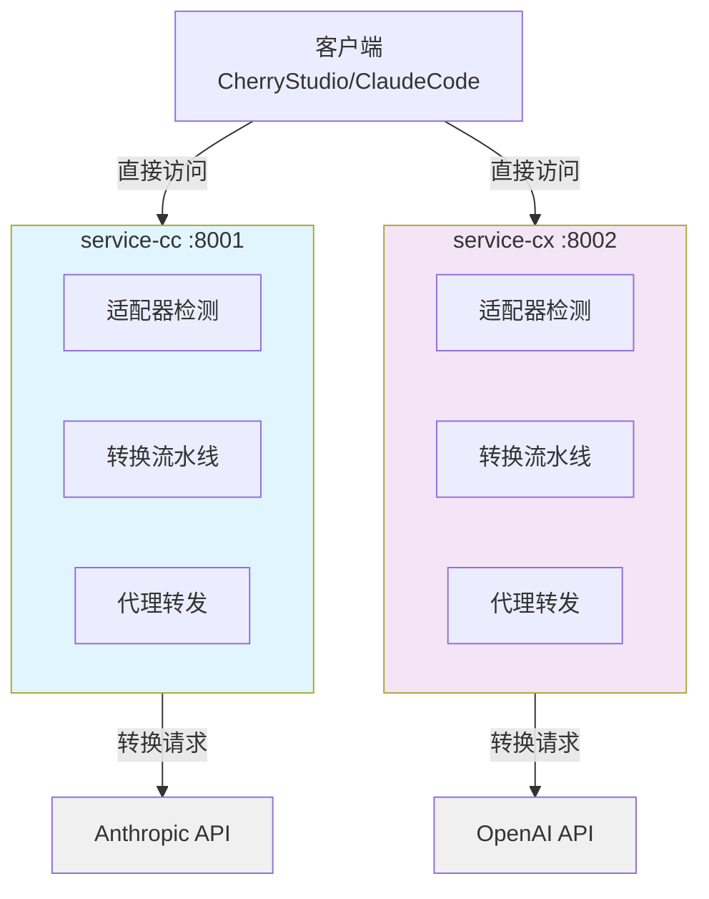

# CC-Proxy 架构文档

> 项目技术架构、开发规范和部署指南

## 📋 项目概览

**项目名称**: CC-Proxy
**版本**: v1.0.0
**技术栈**: Python 3.11+ | FastAPI 0.115+ | Pydantic 2.10+
**架构模式**: 双服务架构 (service-cc + service-cx)
**容器化**: Docker Compose

### 核心功能
- **双服务代理**: Claude API + OpenAI Codex API
- **智能适配**: 自动检测客户端类型并转换请求格式
- **Pipeline架构**: 统一的请求转换和处理流程
- **Session管理**: 优化API缓存命中率
- **环境日志**: 生产/测试环境分离

---

## 🏗️ 系统架构

### 架构图



### 目录结构

```
.
├── start.py               # 统一启动脚本
├── pyproject.toml         # 项目配置和依赖
├── Dockerfile             # 容器镜像构建
├── docker-compose.yml     # 生产环境编排
│
├── common/                # 共享库
│   ├── config.py          # 配置管理
│   ├── logger.py          # 结构化日志
│   ├── http_client.py     # HTTP/2 客户端
│   ├── adapters/          # 适配器基类
│   └── transforms/        # 转换器库
│
├── service-cc/            # Claude 代理服务 :8001
│   ├── main.py            # FastAPI 应用
│   ├── router.py          # API 路由
│   ├── proxy.py           # Anthropic API 代理
│   ├── adapters/          # 客户端适配器
│   ├── pipelines/         # Pipeline 配置
│   ├── formats/           # 格式定义
│   └── schemas/           # 数据模型
│
├── service-cx/            # Codex 代理服务 :8002
│   ├── main.py            # FastAPI 应用
│   ├── router.py          # API 路由
│   ├── proxy.py           # OpenAI API 代理
│   ├── adapters/          # 客户端适配器
│   ├── pipelines/         # Pipeline 配置
│   ├── formats/           # 格式定义
│   └── schemas/           # 数据模型
│
└── docs/                  # 项目文档
    ├── README.md          # 文档索引
    ├── DEPLOYMENT.md      # 部署指南
    ├── DEBUG.md           # 调试手册
    └── requirements.md    # 需求规格
```

---

## 🎯 核心设计

### 设计原则
- **KISS**: 简单直接的架构，避免过度设计
- **DRY**: 提取公共逻辑到共享库
- **YAGNI**: 只实现当前需要的功能
- **类型安全**: 100% Pydantic 类型注解

### 服务职责

```
service-cc (Claude代理):
  ✅ Anthropic API 适配和转换
  ✅ Claude Code 系统提示词注入
  ✅ Session 管理 (12小时轮换)
  ✅ thinking 字段透传

service-cx (Codex代理):
  ✅ OpenAI Responses API 适配
  ✅ Codex instructions 注入
  ✅ 工具集合合并 (7 + MCP工具)
  ✅ 强制流式响应
```

---

## 🚀 数据流

### 完整请求流程

```
1. 客户端请求
   POST http://localhost:8001/v1/messages
   Header: x-api-key: YOUR_API_KEY
   Body: {model, messages, ...}

2. 适配器检测
   ├─ 解析 User-Agent / Headers
   ├─ 选择对应适配器
   └─ 构建转换��下文

3. Pipeline转换
   ├─ 系统提示词注入
   ├─ 消息格式标准化
   ├─ Session信息添加
   └─ 字段解析和验证

4. 代理转发
   ├─ HTTP/2 连接池
   ├─ 请求转发到目标API
   └─ 响应流式返回

5. 响应返回
   目标API → 代理服务 → 客户端
```

---

## 🔧 核心组件

### 1. 统一启动脚本

```python
# 开发环境
ENVIRONMENT=test python start.py

# 生产环境
ENVIRONMENT=production python start.py
```

**特性**:
- 自动选择 uvicorn/gunicorn
- 内存优化和垃圾回收调优
- 动态 worker 数量调整
- 健康检查和监控

### 2. 适配器系统

```python
class ClientAdapter(ABC):
    priority: int = 0

    @abstractmethod
    def detect(self, ctx: AdapterContext) -> bool:
        """检测客户端类型"""
        pass

    @abstractmethod
    def transform(self, ctx: AdapterContext) -> TransformResult:
        """转换请求格式"""
        pass
```

**支持的客户端**:
- **CherryStudio**: 完整适配，支持 thinking 字段
- **Claude Code**: 系统提示词注入，工具集成
- **通用适配**: 标准格式转换

### 3. Pipeline 架构

```python
# service-cc Pipeline (3步)
pipeline = TransformPipeline([
    SystemPromptTransformer(CLAUDE_CODE_SYSTEM),
    SessionTransformer(session_manager),
    EnvironmentContextTransformer()
])

# service-cx Pipeline (6步)
pipeline = TransformPipeline([
    SystemPromptTransformer(CODEX_INSTRUCTIONS),
    MessageNormalizerTransformer(),
    ToolsMergerTransformer(codex_tools),
    SessionTransformer(session_manager),
    FieldResolverTransformer(),
    EnvironmentContextTransformer()
])
```

### 4. Session 管理

**目的**: 最大化API缓存命中率

```python
# Session ID 格式
user_proxy_account__session_{date}-{half_day_mark}-{counter}

# 12小时轮换机制
00:00-12:00 → session_1
12:00-24:00 → session_2
```

---

## 📝 代码规范

### 命名规范
- **文件名**: `snake_case.py`
- **类名**: `PascalCase`
- **函数名**: `snake_case()`
- **常量**: `UPPER_SNAKE_CASE`

### 类型注解
```python
def transform_request(
    body: dict[str, Any],
    headers: dict[str, str],
    api_key: str | None = None,
) -> dict[str, Any]:
    """转换请求格式"""
    pass
```

### 错误处理
```python
try:
    response = await http_client.post(url, json=body)
except httpx.HTTPStatusError as e:
    raise AuthenticationError("Invalid API key") from e
```

---

## 🛠️ 开发工作流

### 添加新客户端

```python
# 1. 创建适配器
class NewClientAdapter(ClientAdapter):
    priority = 50

    def detect(self, ctx: AdapterContext) -> bool:
        return "new-client" in ctx.raw_headers.get("user-agent", "")

    def transform(self, ctx: AdapterContext) -> TransformResult:
        # 转换逻辑
        return TransformResult(body=transformed_body, headers=ctx.raw_headers)

# 2. 注册适配器
adapter_manager.register(NewClientAdapter())
```

### 启动和测试

```bash
# 安装依赖
uv sync

# 启动服务
ENVIRONMENT=test python start.py

# 健康检查
curl http://localhost:8001/health  # Claude Service
curl http://localhost:8002/health  # Codex Service

# 测试API
curl http://localhost:8001/v1/messages \
  -H "x-api-key: YOUR_ANTHROPIC_API_KEY" \
  -d '{"model":"claude-sonnet-4","messages":[{"role":"user","content":"test"}]}'
```

---

## 🔍 调试技巧

### 查看日志
```bash
# 开发环境日志输出到终端
ENVIRONMENT=test python start.py

# 生产环境使用结构化JSON日志
ENVIRONMENT=production python start.py
```

### 调试端点
```bash
# 查看适配器列表
curl http://localhost:8001/adapters

# 查看服务信息
curl http://localhost:8001/v1
curl http://localhost:8002/v1
```

---

## 🚧 常见问题

### Q: 如何修改API目标地址？
A: 编辑 `.env` 文件中的 `ANTHROPIC_BASE_URL` 和 `OPENAI_BASE_URL`

### Q: 如何调整Session轮换时间？
A: 修改 `service-cc/formats/session.py` 中的 TTL 设置

### Q: 如何添加新的转换逻辑？
A: 继承 `Transformer` 基类，添加到 Pipeline 配置中

---

## 📊 性能指标

| 指标 | 目标值 | 说明 |
|------|--------|------|
| 响应延迟 | <100ms | P95延迟 |
| 并发连接 | 1000+ | HTTP/2多路复用 |
| 内存占用 | <200MB | 单服务实例 |
| 吞吐量 | 100+ QPS | 取决于API限制 |

---

## 🔗 相关资源

- **FastAPI文档**: https://fastapi.tiangolo.com
- **Pydantic文档**: https://docs.pydantic.dev
- **Anthropic API**: https://docs.anthropic.com
- **OpenAI API**: https://platform.openai.com/docs

---

**文档版本**: v1.0.0
**最后更新**: 2025-10-31
**维护者**: CC-Proxy Development Team