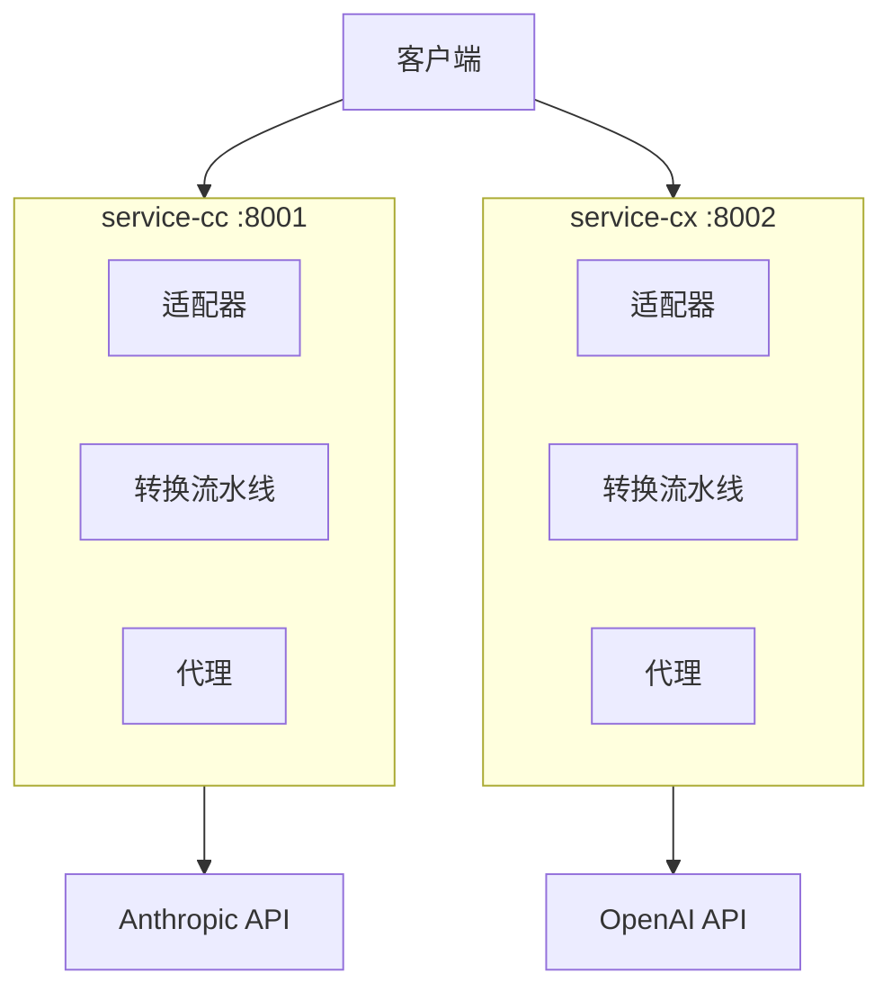

# CC-Proxy 架构文档

## 📋 项目概览

**双服务架构**: service-cc (Claude) + service-cx (Codex)
**技术栈**: Python 3.11+, FastAPI, Pydantic
**核心功能**: 智能适配 + Pipeline转换 + Session管理

## 🏗️ 架构图



## 🎯 核心组件

### 1. 适配器系统
```python
class ClientAdapter(ABC):
    def detect(self, ctx: AdapterContext) -> bool: pass
    def transform(self, ctx: AdapterContext) -> TransformResult: pass
```

**支持客户端**: CherryStudio, Claude Code, 通用适配

### 2. Pipeline架构
```python
# service-cc (3步)
SystemPromptTransformer → SessionTransformer → EnvironmentContextTransformer

# service-cx (6步)
SystemPromptTransformer → MessageNormalizer → ToolsMerger →
SessionTransformer → FieldResolver → EnvironmentContextTransformer
```

### 3. Session管理
```
格式: user_proxy_account__session_{date}-{half_day}-{counter}
轮换: 每12小时 (00:00, 12:00)
目的: ���大化API缓存命中率
```

## 🚀 数据流

```
客户端请求 → 适配器检测 → Pipeline转换 → 代理转发 → API响应
```

## 📝 代码规范

- **命名**: snake_case.py, PascalCase, snake_case()
- **类型**: 100% Pydantic 注解
- **错误**: 异常链处理

## 🛠️ 开发

```bash
# 启动
ENVIRONMENT=test python start.py

# 测试
curl http://localhost:8001/health
curl http://localhost:8001/v1/messages
```

---

**v1.0.0** | **2025-10-31**